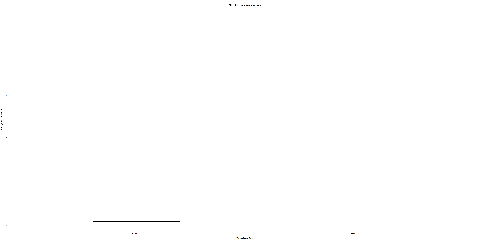
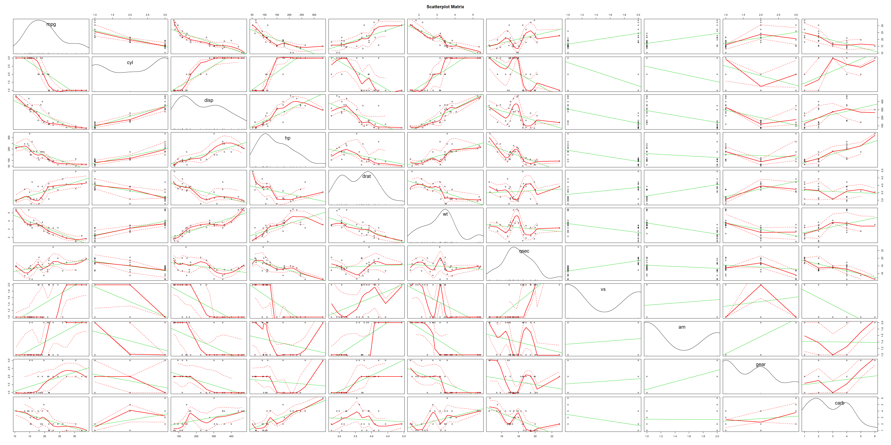
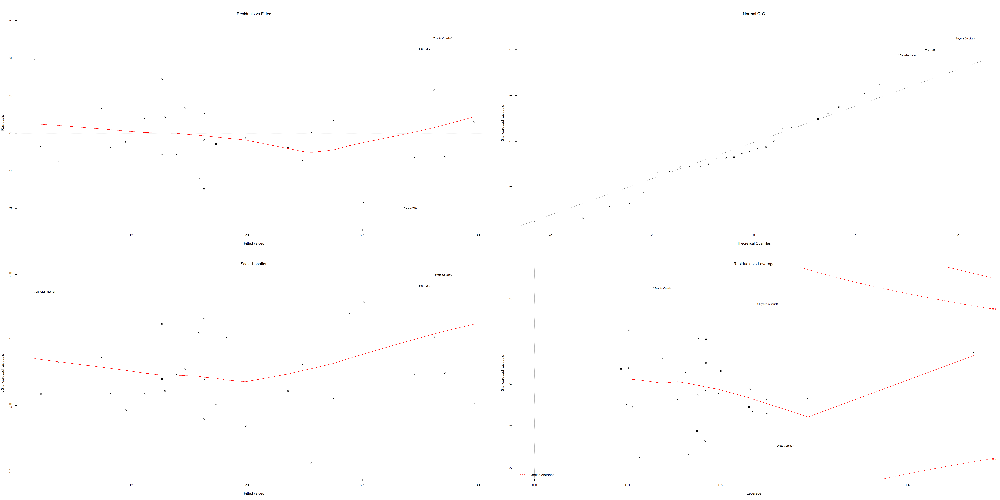

#Summary

Motor Tren Magazine performing analysis on Automatic and Manual transmission which is economically best or gives more miles per gallon(MPG).  They are particularly interested in the following two questions:  
"Is an automatic or manual transmission better for MPG"  
"Quantify the MPG difference between automatic and manual transmissions"  


#Analysis  
##Data Processing  
  Loading mtcars data to find the relation between mpg and other data elements in mtcars dataset.  
  

```r
data("mtcars")
dim(mtcars)
```

```
## [1] 32 11
```
32 rows and 11 columns available in dataset  

Initially we will check the mean MPG (miles per gallon) for automatic and manual transmission  
0 - automatic transmission  
1 - manual transmission  


```r
autmean <- mtcars[mtcars$am == 0,]
summary(autmean)[4,1] #Automatic
```

```
## [1] "Mean   :17.15  "
```

```r
manmean <- mtcars[mtcars$am == 1,]
summary(manmean)[4,1] #Manual
```

```
## [1] "Mean   :24.39  "
```

Manual transmission **Mean   :24.39  ** is heigher than automaic transmission **Mean   :17.15  **

###Quantifying MPG differences using boxplot

```r
#Updating transmission label 
mtcars$am <- factor(mtcars$am, labels = c("Automatic", "Manual"))
boxplot(mpg ~ am, data = mtcars, xlab = "Transmission Type", ylab = "MPG (miles per gallon)", main="MPG for Transmission Type")
```

 
Manual transmission gives more milage as per boxplot results  

###t-test  
Perfoming t-test to test this hypothesis (as alpha=0.5)  

```r
aggres <- aggregate(mpg~am, data = mtcars, mean)
(aggres[2,2] - aggres[1,2])
```

```
## [1] 7.244939
```

```r
t.test(autmean$mpg, manmean$mpg)
```

```
## 
## 	Welch Two Sample t-test
## 
## data:  autmean$mpg and manmean$mpg
## t = -3.7671, df = 18.332, p-value = 0.001374
## alternative hypothesis: true difference in means is not equal to 0
## 95 percent confidence interval:
##  -11.280194  -3.209684
## sample estimates:
## mean of x mean of y 
##  17.14737  24.39231
```
**P-value = 0.001374**, we reject this null hypothesis. It means there exist a major difference between automatic and manual transmission  

Transforming cyl, vs, gear, and carb data elements to proceed with our analysis.

```r
#converting factor variables for plots and models
mtcars$cyl <- factor(mtcars$cyl)
mtcars$vs <- factor(mtcars$vs)
mtcars$gear <- factor(mtcars$gear)
mtcars$carb <- factor(mtcars$carb)
str(mtcars)
```

```
## 'data.frame':	32 obs. of  11 variables:
##  $ mpg : num  21 21 22.8 21.4 18.7 18.1 14.3 24.4 22.8 19.2 ...
##  $ cyl : Factor w/ 3 levels "4","6","8": 2 2 1 2 3 2 3 1 1 2 ...
##  $ disp: num  160 160 108 258 360 ...
##  $ hp  : num  110 110 93 110 175 105 245 62 95 123 ...
##  $ drat: num  3.9 3.9 3.85 3.08 3.15 2.76 3.21 3.69 3.92 3.92 ...
##  $ wt  : num  2.62 2.88 2.32 3.21 3.44 ...
##  $ qsec: num  16.5 17 18.6 19.4 17 ...
##  $ vs  : Factor w/ 2 levels "0","1": 1 1 2 2 1 2 1 2 2 2 ...
##  $ am  : Factor w/ 2 levels "Automatic","Manual": 2 2 2 1 1 1 1 1 1 1 ...
##  $ gear: Factor w/ 3 levels "3","4","5": 2 2 2 1 1 1 1 2 2 2 ...
##  $ carb: Factor w/ 6 levels "1","2","3","4",..: 4 4 1 1 2 1 4 2 2 4 ...
```

We will explore the relationships between the varaibles and outcome using scatterplot matrix:

```r
library(car)
scatterplot.matrix(~mpg + cyl + disp + hp + drat + wt + qsec + vs + am + gear + 
    carb, data = mtcars, main = "Scatterplot Matrix")
```

 
Based on scatterplot results, mpg has high corelation with few variables.    
Initially building a model lm(linear regression model) with all variables as predictors. Applying **Step** method to perform stepwise model selection to select significant predictors for the final model, using both forward selection and backward elimination methods.  

```r
fit1 <- lm(mpg ~. , data=mtcars)
fit2 <- step(fit1, direction = "both", trace=0)
```
The best model includes cyl, wt, hp and am as predictors for mpg   

###Residuals and Diagnostics   
We will use residual plots of our regression model to compute some of the regression diagnostics for our model and find out some interesting outliers in the data set  


```r
par(mfrow = c(2,2))
plot(fit2)
```

 
**Residual Plot observations:**  
Residuals vs Fitted plot random points confirms that the independence condition. Normal Q-Q plot the points shows that the residuals are normally distributed. Scale-Location plot the points patterns indicating the constant variance. Residuals vs Leverage plot shows some leverage points are in the top right corner of the plot.  


```r
summary(fit2)
```

```
## 
## Call:
## lm(formula = mpg ~ cyl + hp + wt + am, data = mtcars)
## 
## Residuals:
##     Min      1Q  Median      3Q     Max 
## -3.9387 -1.2560 -0.4013  1.1253  5.0513 
## 
## Coefficients:
##             Estimate Std. Error t value Pr(>|t|)    
## (Intercept) 33.70832    2.60489  12.940 7.73e-13 ***
## cyl6        -3.03134    1.40728  -2.154  0.04068 *  
## cyl8        -2.16368    2.28425  -0.947  0.35225    
## hp          -0.03211    0.01369  -2.345  0.02693 *  
## wt          -2.49683    0.88559  -2.819  0.00908 ** 
## amManual     1.80921    1.39630   1.296  0.20646    
## ---
## Signif. codes:  0 '***' 0.001 '**' 0.01 '*' 0.05 '.' 0.1 ' ' 1
## 
## Residual standard error: 2.41 on 26 degrees of freedom
## Multiple R-squared:  0.8659,	Adjusted R-squared:  0.8401 
## F-statistic: 33.57 on 5 and 26 DF,  p-value: 1.506e-10
```

From summary, the adjusted R square value is equal to 0.84 which is the maximum obtained by considering **cyl, hp, wt, and am** variables. So we could conclude more than 84% of the variability is explained by this model.  

Using NOVA we will compare the base model with only am as predictor to confirm fit2 is the best model.  

###Hypothesis

```r
final_model <- lm(mpg ~ am, data = mtcars)
anova(fit2, final_model)
```

```
## Analysis of Variance Table
## 
## Model 1: mpg ~ cyl + hp + wt + am
## Model 2: mpg ~ am
##   Res.Df    RSS Df Sum of Sq      F    Pr(>F)    
## 1     26 151.03                                  
## 2     30 720.90 -4   -569.87 24.527 1.688e-08 ***
## ---
## Signif. codes:  0 '***' 0.001 '**' 0.01 '*' 0.05 '.' 0.1 ' ' 1
```
P-value obtained is highly significant. Hence we reject this null hypothesis that the confounder variables cyl, hp and wt do not contribute to get the accuracy of the model.  
###Conclusion  

Observations from summary(fit2)  
Motor Trend Analysis concluded that 'Manual' transmission gives **1.80** more miles per gallon (MPG) than 'Automatic' transmission (adjusted by hp, wt, and am). 

